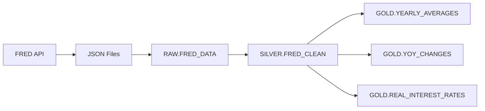

# 📊 Data Lineage Project with FRED Economic Data

A complete data engineering pipeline that fetches economic data from the Federal Reserve Economic Data (FRED) API, loads it into Snowflake, and transforms it using dbt for analytics and reporting.

## 🎯 Project Overview

This project demonstrates a modern data stack with:
- **API Data Ingestion** from FRED (Federal Reserve Economic Data)
- **Data Warehousing** with Snowflake
- **Data Transformation** using dbt (data build tool)
- **Data Lineage Tracking** with DataHub integration

## 🏗️ Architecture

```
FRED API → Python Scripts → Snowflake → dbt → Analytics Views
    ↓           ↓              ↓         ↓         ↓
Raw JSON → data/raw/ → RAW.FRED_DATA → SILVER → Business Intelligence
```

## 📈 Economic Indicators Tracked

- **GDPC1** - Real GDP (Billions $)
- **UNRATE** - Unemployment Rate (%)
- **CPIAUCSL** - Consumer Price Index (1982-1984=100)
- **INDPRO** - Industrial Production (2017=100)
- **PCE** - Personal Consumption Expenditures (Billions)
- **FEDFUNDS** - Federal Funds Rate (%)

## 🛠️ Tech Stack

- **Python 3.10+** - Data ingestion and processing
- **Snowflake** - Cloud data warehouse
- **dbt** - Data transformation and modeling
- **FRED API** - Economic data source
- **DataHub** - Data discovery and lineage (optional)

## 🚀 Quick Start

### Prerequisites
```bash
# Install Python dependencies
pip install snowflake-connector-python dbt-snowflake python-dotenv requests

# Install DataHub CLI with dbt extras (for lineage ingest)
pip install "acryl-datahub[dbt]"
```

### Environment Setup
Create a `.env` file:
```env
FRED_API_KEY=your_fred_api_key_here
SNOWFLAKE_ACCOUNT=your_account
SNOWFLAKE_USER=your_username  
SNOWFLAKE_PASSWORD=your_password
SNOWFLAKE_WAREHOUSE=your_warehouse
SNOWFLAKE_DATABASE=your_database
SNOWFLAKE_SCHEMA=RAW
```

### 1. Data Ingestion
```bash
# Fetch latest economic data from FRED API
python api_ingestion/fetch_data.py
```

### 2. Load to Snowflake
```bash
# Upload JSON data to Snowflake RAW layer
python snowflake_load/load_to_snowflake.py
```

### 3. dbt Transformations
```bash
cd lineage_dbt
dbt debug  # Test connection
dbt run     # Run all transformations
dbt test    # Run data quality tests (Assertions in DataHub)
dbt docs generate  # Generate manifest.json & catalog.json
```

### 4. Bring up DataHub (optional but recommended)
```bash
# From repository root
docker compose up -d
# UI: http://localhost:9002 , GMS API: http://localhost:8080
```

### 5. Ingest dbt metadata to DataHub
```bash
# From repository root
datahub ingest -c configs/dbt_to_datahub.yml
```
Notes:
- The recipe points to `lineage_dbt/target/manifest.json` and `catalog.json` and ingests models, sources, and tests as Assertions.
- On Windows, ensure the shell is UTF-8 if you see Unicode errors:
  - PowerShell one-off: `$env:PYTHONUTF8 = "1"`

### (Optional) Ingest Snowflake metadata to DataHub
Create `configs/snowflake_to_datahub.yml` with env vars (avoid committing secrets):
```yaml
source:
  type: snowflake
  config:
    account_id: "${SNOWFLAKE_ACCOUNT}"
    username: "${SNOWFLAKE_USER}"
    password: "${SNOWFLAKE_PASSWORD}"
    database_pattern:
      allow:
        - "DATAHUB_DEMO"
    include_table_lineage: true
    include_view_lineage: true
    profiling:
      enabled: false

sink:
  type: datahub-rest
  config:
    server: "http://localhost:8080"
```
Run:
```bash
$env:SNOWFLAKE_ACCOUNT="..."; $env:SNOWFLAKE_USER="..."; $env:SNOWFLAKE_PASSWORD="..."
datahub ingest -c configs/snowflake_to_datahub.yml
```

## 📊 Data Models

### Silver Layer (Cleaned Data)
- **`fred_clean`** - Cleaned and standardized FRED data with proper data types

### Gold Layer (Analytics)
- **`yearly_averages`** - Average annual values for each economic indicator
- **`yoy_changes`** - Year-over-year percentage changes analysis
- **`real_interest_rates`** - Real interest rates calculation (Fed Funds - Inflation)

## 📁 Project Structure

```
├── api_ingestion/          # FRED API data fetching
│   ├── __init__.py
│   └── fetch_data.py
├── configs/                # Configuration files
│   ├── __init__.py
│   └── fred_series.py      # FRED series definitions
├── data/
│   └── raw/                # Downloaded JSON files
├── lineage_dbt/            # dbt project
│   ├── dbt_project.yml
│   ├── profiles.yml
│   └── models/
│       └── example/
│           ├── silver/     # Cleaned data models
│           └── gold/       # Analytics models
├── snowflake_load/         # Snowflake loading scripts
│   └── load_to_snowflake.py
├── logs/                   # Application logs
└── README.md
```

### Where to add quality tests (dbt)

- Place tests inside the `schema.yml` files alongside your models.
  - Example in this repo: `lineage_dbt/models/example/schema.yml`
  - Add tests under each model's `columns: ... data_tests:` block.
- Add new models under:
  - `lineage_dbt/models/example/silver/` for cleaned views/tables
  - `lineage_dbt/models/example/gold/` for analytics views
- After editing tests/models:
  ```bash
  cd lineage_dbt
  dbt run            # build models
  dbt test           # run quality tests
  dbt docs generate  # refresh manifest.json & catalog.json
  cd ..
  datahub ingest -c configs/dbt_to_datahub.yml  # publish to DataHub (Assertions)
  ```

## 🔄 Data Lineage



## 📋 Data Quality & Testing

```bash
# Run dbt tests
dbt test

# Check data freshness
dbt source freshness
```
Included tests (Assertions in DataHub):
- `fred_clean`: not_null on key columns, accepted_values for `series_id`
- `yearly_averages`, `yoy_changes`, `real_interest_rates`: not_null on output columns
- Starter models `my_first_dbt_model`, `my_second_dbt_model` have tests marked as severity=warn until those models are materialized

## 🏃‍♂️ Running the Full Pipeline

```bash
# 1. Fetch latest data
python api_ingestion/fetch_data.py

# 2. Load to Snowflake  
python snowflake_load/load_to_snowflake.py

# 3. Transform with dbt
cd lineage_dbt && dbt run

# 4. Generate documentation
dbt docs generate && dbt docs serve
```

## 📊 Sample Queries

### Economic Trends Analysis
```sql
-- Top 3 years with highest GDP growth
SELECT year, yoy_change_pct 
FROM SILVER.YOY_CHANGES 
WHERE series_id = 'GDPC1' 
ORDER BY yoy_change_pct DESC 
LIMIT 3;
```

### Real Interest Rate Analysis
```sql
-- Years with negative real interest rates
SELECT year, real_interest_rate
FROM SILVER.REAL_INTEREST_RATES 
WHERE real_interest_rate < 0
ORDER BY year;
```

## 🤝 Contributing

1. Fork the repository
2. Create a feature branch (`git checkout -b feature/amazing-feature`)
3. Commit your changes (`git commit -m 'Add amazing feature'`)
4. Push to the branch (`git push origin feature/amazing-feature`)
5. Open a Pull Request

## 📄 License

This project is licensed under the MIT License - see the LICENSE file for details.

## 🙏 Acknowledgments

- **Federal Reserve Bank of St. Louis** for providing the FRED API
- **Snowflake** for the cloud data warehouse platform
- **dbt Labs** for the transformation framework

## 📞 Contact

For questions or suggestions, please open an issue in this repository.

---

**Built with ❤️ for modern data engineering**